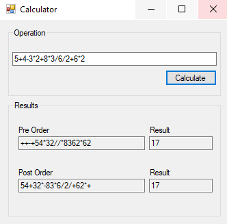

# Calculator
This calculator can calculate Arithmetic operations with a list, a binary tree and a LIFO stack.

## Usage

We need to put our operation in the text box and click on "calculate" button.

The program shows the Pre Order and Post Order of the tree.

### Linked list

Every element (number or operator) is a "node" that has previous and next element.

### Tree

Depends of the operator, we build a tree which has the elements of the linked list.

### LIFO

This stack helps to make the operations (depends of the order).